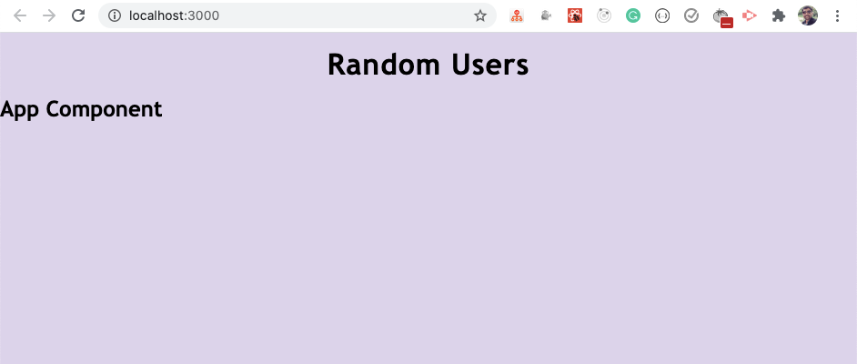
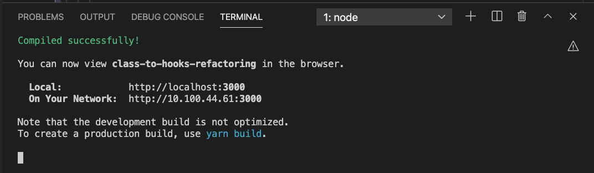

# How to Build a React Application with Load More Functionality using React Hooks

> https://www.freecodecamp.org/news/build-a-react-application-with-load-more-functionality-react-hooks/
> npm i && npm run start

In this article, we will build a React application using class components. Then we'll convert it to functional components using React Hooks in a step-by-step way.

By building this app, you will learn:

- How to make API calls
- How to implement load more functionality
- How to debug application issues
- How to use async/await
- How to update the component when something changes
- How to fix the infinite loop issue in the useEffect hook
- How to refactor class-based components into functional components with Hooks

and much more.

So let’s get started.

## Initial Project Setup

Create a new project using ```create-react-app```:

```
npx create-react-app class-to-hooks-refactoring
```

Once the project is created, delete all files from the ```src``` folder and create the ```index.js``` file and the ```styles.css``` file inside the ```src``` folder. Also, create a ```components``` folders inside the ```src``` folder.

Install the ```axios``` library by executing the following command from the project folder:

```shell
npm install axios@0.21.1
```

Open the ```styles.css``` file and add the contents from [this GitHub repo](https://github.com/feanlau/class-to-hooks-refactoring) to it.

## How to Create the Initial Pages

Create a new file called ```Header.js``` inside the ```components``` folder with the following content:

```javascript
import React from "react";

const Header = () => {
  return <h1 className="header">Random Users</h1>;
};

export default Header;
```

Create a new file called ```App.js``` inside the ```src``` folder with the following content:

```javascript
import React from 'react';
import Header from './components/Header';

export default class App extends React.Component {
  render() {
    return (
      <div className="main-section">
        <Header />
        <h2>App Component</h2>
      </div>
    );
  }
}
```

Now, open the index.js file and add the following content to it:

import React from 'react';
import ReactDOM from 'react-dom';
import App from './App';
import './styles.css';

ReactDOM.render(<App />, document.getElementById('root'));
Now, start the application by running the yarn start command from the terminal.

You will see the following screen if you access the application at http://localhost:3000/.


How to Make an API Call
We will be using the Random Users API to get a list of random users.

So open your App.js file and add the componentDidMount method inside the component:

componentDidMount() {
    axios
      .get('https://randomuser.me/api/?page=0&results=10')
      .then((response) => {
        console.log(response.data);
      })
      .catch((error) => console.log('error', error));
  }
Also, import axios at the top of the file:

import axios from 'axios';
Your entire App.js file will look like this now:

import React from 'react';
import Header from './components/Header';
import axios from 'axios';

export default class App extends React.Component {
  componentDidMount() {
    axios
      .get('https://randomuser.me/api/?page=0&results=10')
      .then((response) => {
        console.log(response.data);
      })
      .catch((error) => console.log('error', error));
  }

  render() {
    return (
      <div className="main-section">
        <Header />
        <h2>App Component</h2>
      </div>
    );
  }
}
Here, we're making an API call to get a list of 10 records initially to the URL https://randomuser.me/api/?page=0&results=10.

Now, if you check the application, you will see the response from the API in the console.

result-1
Now, let's declare a state to store the result and flags related to the loading and error messages.

Replace the contents of App.js with the following code:

import React from 'react';
import Header from './components/Header';
import axios from 'axios';

export default class App extends React.Component {
  state = {
    users: [],
    isLoading: false,
    errorMsg: ''
  };

  componentDidMount() {
    this.setState({ isLoading: true });
    axios
      .get('https://randomuser.me/api/?page=0&results=10')
      .then((response) => {
         this.setState({ users: response.data.results, errorMsg: '' });
      })
      .catch((error) =>
        this.setState({
          errorMsg: 'Error while loading data. Try again later.'
        })
      )
      .finally(() => {
        this.setState({ isLoading: false });
      });
  }

  render() {
    const { users, isLoading, errorMsg } = this.state;
    console.log(users);

    return (
      <div className="main-section">
        <Header />
        {isLoading && <p className="loading">Loading...</p>}
        {errorMsg && <p className="errorMsg">{errorMsg}</p>}
      </div>
    );
  }
}
Here, we've declared a state directly inside the class using class properties syntax which is a common way to write state in class-based components.

state = {
  users: [],
  isLoading: false,
  errorMsg: ''
};
Then, inside the componentDidMount method, we're first setting the isLoading state to true before making the API call.

this.setState({ isLoading: true });
Once we get the API response, we're storing the result in the users array which is declared in the state. We're also setting the errorMsg state to empty, so that if there are any previous errors they will be cleared out.

this.setState({ users: response.data.results, errorMsg: '' });
And in the .catch block, we're setting the errorMsg in case there is any error while making an API call.

Then, we're using the .finally block to set the isLoading state to false.

.finally(() => {
  this.setState({ isLoading: false });
});
Using finally helps us avoid code duplication here because we don't need to set isLoading to false in .then and in the .catch block again. This is because the finally block will always be executed whether it's successful or not.

And in the render method, we're displaying either the error message or loading message along with the users array from the state in the console.

Now, if you check the application, you will see the users information in the console on success or an error message on the UI for API failure.

How to Display the Users Information
Now, let's display the users information on the screen.

Create a new file User.js inside the components folder with the following content:

import React from "react";

const User = ({ name, location, email, picture }) => {
  return (
    <div className="random-user">
      <div className="user-image">
        
      </div>
      <div className="user-details">
        <div>
          <strong>Name:</strong> {name.first} {name.last}
        </div>
        <div>
          <strong>Country:</strong> {location.country}
        </div>
        <div>
          <strong>Email:</strong> {email}
        </div>
      </div>
    </div>
  );
};

export default User;
Now, create a new file UsersList.js inside the components folder with the following content:

import React from 'react';
import User from './User';

const UsersList = ({ users }) => {
  return (
    <div className="user-list">
      {users && users.map((user) => <User key={user.login.uuid} {...user} />)}
    </div>
  );
};

export default UsersList;
Now, open the App.js file and replace the render method with the following code:

render() {
  const { users, isLoading, errorMsg } = this.state;

  return (
    <div className="main-section">
      <Header />
      {isLoading && <p className="loading">Loading...</p>}
      {errorMsg && <p className="errorMsg">{errorMsg}</p>}
      <UsersList users={users} />
    </div>
  );
}
Here, we're passing the users array as a prop to the UsersList component. Inside the UsersList component, we're looping over the array and sending the user information to the User component by spreading out all the properties of the individual user as {...props}. This finally displays the data on the screen.

Also, import the UsersList component at the top of the file:

import UsersList from './components/UsersList';
If you check the application now, you will see the following screen:

random_users
As you can see, on every page refresh, a new set of random users is displayed on the screen.

How to Add the Load More Functionality
Now, let's add the load more functionality which will let our app load the next set of 10 users on every load more click.

Change the render method of the App.js file to the following code:

render() {
  const { users, isLoading, errorMsg } = this.state;

  return (
    <div className="main-section">
      <Header />
      <UsersList users={users} />
      {errorMsg && <p className="errorMsg">{errorMsg}</p>}
      <div className="load-more">
        <button onClick={this.loadMore} className="btn-grad">
          {isLoading ? 'Loading...' : 'Load More'}
        </button>
      </div>
    </div>
  );
}
Here, we've added the isLoading check inside the button to display either the Loading... or Load More text on the button.

Add a new page property to the state and initialize it to 0.

state = {
  users: [],
  page: 0,
  isLoading: false,
  errorMsg: ''
};
And add the loadMore handler function before the render method to increment the page state value by 1 on every button click.

loadMore = () => {
  this.setState((prevState) => ({
    page: prevState.page + 1
  }));
};
Here, we're using the previous state to calculate the next state value of the page, so the above code is the same as the below code:

loadMore = () => {
  this.setState((prevState) => {
    return {
      page: prevState.page + 1
    };
  });
};
We're just using ES6 shorthand syntax for returning an object from the function.

Now, inside the componentDidMount method, change the API URL from the below code:

'https://randomuser.me/api/?page=0&results=10'
to this code:

`https://randomuser.me/api/?page=${page}&results=10`
Here, we're using the ES6 template literal syntax to use the dynamic value of the page state to load the next set of users on every button click.

Destructure the page from state inside the componentDidMount method like this:

componentDidMount() {
  const { page } = this.state;
  ....
}
Want to explore all the ES6+ features in detail? Check out my Mastering Modern JavaScript book.
Now, let's check the application's functionality.

load_more_state_changing
As you can see, when we click on the Load More button, the page state is changing in the react dev tools but we're not getting the new list of users displayed on the screen.

This is because even though we're changing the page state, we're not making API call again to get the next set of users with the changed page value. So let's fix this.

Create a new loadUsers function above the loadMore function and move all the code from componentDidMount to inside the loadUsers function. Then call the loadUsers function from the componentDidMount method.

Also, add a componentDidUpdate method inside the App component like this:

componentDidUpdate(prevProps, prevState) {
  if (prevState.page !== this.state.page) {
    this.loadUsers();
  }
}
As we're updating the value of the page state in the loadMore function once the state is updated, the componentDidUpdate method will be called. So we're checking if the previous state value of page is not equal to the current state value. Then we make the API call again by calling the loadUsers function.

Check out my previous article to learn more about why and when we need to use the componentDidUpdate method.
Your complete App.js file will look like this now:

import React from 'react';
import Header from './components/Header';
import axios from 'axios';
import UsersList from './components/UsersList';

export default class App extends React.Component {
  state = {
    users: [],
    page: 0,
    isLoading: false,
    errorMsg: ''
  };

  componentDidMount() {
    this.loadUsers();
  }

  componentDidUpdate(prevProps, prevState) {
    if (prevState.page !== this.state.page) {
      this.loadUsers();
    }
  }

  loadUsers = () => {
    const { page } = this.state;

    this.setState({ isLoading: true });
    axios
      .get(`https://randomuser.me/api/?page=${page}&results=10`)
      .then((response) => {
        this.setState({ users: response.data.results, errorMsg: '' });
      })
      .catch((error) =>
        this.setState({
          errorMsg: 'Error while loading data. Try again later.'
        })
      )
      .finally(() => {
        this.setState({ isLoading: false });
      });
  };

  loadMore = () => {
    this.setState((prevState) => ({
      page: prevState.page + 1
    }));
  };

  render() {
    const { users, isLoading, errorMsg } = this.state;

    return (
      <div className="main-section">
        <Header />
        <UsersList users={users} />
        {errorMsg && <p className="errorMsg">{errorMsg}</p>}
        <div className="load-more">
          <button onClick={this.loadMore} className="btn-grad">
            {isLoading ? 'Loading...' : 'Load More'}
          </button>
        </div>
      </div>
    );
  }
}
Now, if you check the application again by running the yarn start command you will see the following screen:

new_users_loaded
As you can see, we're getting a new list of users displayed on every load more button click. But the issue is that we're only able to see 10 users at a time.

So let's make changes to add new users to the already displayed list of users.

For this, we need to change the way we're setting the users state.

Our current setState call inside the loadUsers function looks like this:

this.setState({ users: response.data.results, errorMsg: '' });
Here, we're always replacing the users array with the new set of users. So change the above setState call to the following code:

this.setState((prevState) => ({
  users: [...prevState.users, ...response.data.results],
  errorMsg: ''
}));
Here, we're using the updater syntax of setState. We're creating a new array by spreading out the already added users by using ...prevState.users, and then we're adding a new set of users by using ...response.data.results.

So this way we'll not lose the previous loaded users data and we'll also be able to append a new set of users.

Now, if you check the application again, you will see the correct behavior of data loading.


How to Improve the Code using Async/await
If you check the loadUsers function, you will see that the code looks complex and difficult to read.

loadUsers = () => {
  const { page } = this.state;

  this.setState({ isLoading: true });
  axios
    .get(`https://randomuser.me/api/?page=${page}&results=10`)
    .then((response) => {
      this.setState((prevState) => ({
        users: [...prevState.users, ...response.data.results],
        errorMsg: ''
      }));
    })
    .catch((error) =>
      this.setState({
        errorMsg: 'Error while loading data. Try again later.'
      })
    )
    .finally(() => {
      this.setState({ isLoading: false });
    });
};
We can fix this using async/await syntax.

First, we need to mark the loadUsers function as async:

loadUsers = async () => {
Because we can use the await keyword only inside the function which is declared as async.

Now, replace the loadUsers function with the following code:

loadUsers = async () => {
  try {
    const { page } = this.state;

    this.setState({ isLoading: true });
    const response = await axios.get(
      `https://randomuser.me/api/?page=${page}&results=10`
    );

    this.setState((prevState) => ({
      users: [...prevState.users, ...response.data.results],
      errorMsg: ''
    }));
  } catch (error) {
    this.setState({
      errorMsg: 'Error while loading data. Try again later.'
    });
  } finally {
    this.setState({ isLoading: false });
  }
};
Here, we've used the await keyword before the axios.get call so the next line of code which is the setState call will not be executed until we get the response from the API.

If there is any error while getting the response from the API, the catch block will be executed. The finally block will set the isLoading state to false.

Your changed App.js file will look like this now:

import React from 'react';
import Header from './components/Header';
import axios from 'axios';
import UsersList from './components/UsersList';

export default class App extends React.Component {
  state = {
    users: [],
    page: 0,
    isLoading: false,
    errorMsg: ''
  };

  componentDidMount() {
    this.loadUsers();
  }

  componentDidUpdate(prevProps, prevState) {
    if (prevState.page !== this.state.page) {
      this.loadUsers();
    }
  }

  loadUsers = async () => {
    try {
      const { page } = this.state;

      this.setState({ isLoading: true });
      const response = await axios.get(
        `https://randomuser.me/api/?page=${page}&results=10`
      );

      this.setState((prevState) => ({
        users: [...prevState.users, ...response.data.results],
        errorMsg: ''
      }));
    } catch (error) {
      this.setState({
        errorMsg: 'Error while loading data. Try again later.'
      });
    } finally {
      this.setState({ isLoading: false });
    }
  };

  loadMore = () => {
    this.setState((prevState) => ({
      page: prevState.page + 1
    }));
  };

  render() {
    const { users, isLoading, errorMsg } = this.state;

    return (
      <div className="main-section">
        <Header />
        <UsersList users={users} />
        {errorMsg && <p className="errorMsg">{errorMsg}</p>}
        <div className="load-more">
          <button onClick={this.loadMore} className="btn-grad">
            {isLoading ? 'Loading...' : 'Load More'}
          </button>
        </div>
      </div>
    );
  }
}
Now, the loadUsers function code looks much cleaner and easier to understand than it was before. And if you check the application, you will see that the application is also working correctly.


How to Refactor Class Component Code to Functional Component Code
We're done building out the complete functionality of the app. So let's refactor the code to use functional components with React Hooks.

If you're new to React Hooks, check out my article here for an introduction to Hooks.
Create a new file called AppFunctional.js inside the src folder with the following content:

import React from 'react';

const AppFunctional = () => {
  return (
    <div>
      <h2>Functional Component</h2>
    </div>
  );
};

export default AppFunctional;
We've created a new file for the functional component so you will be able to compare both the code and keep it for your reference.

Now, open the index.js file and replace the contents of the file with the following code:

import React from 'react';
import ReactDOM from 'react-dom';
import AppFunctional from './AppFunctional';
import './styles.css';

ReactDOM.render(<AppFunctional />, document.getElementById('root'));
Here, we've used the AppFunctional component inside the render method and we've also added the import for the same at the top of the file.

Now, if you restart your application using the yarn start command you will see the following screen:

functional_component
So we're correctly displaying the AppFunctional component code on the screen.

Now, replace the contents of theAppFunctional component with the following code:

import React, { useState, useEffect } from 'react';
import axios from 'axios';
import Header from './components/Header';
import UsersList from './components/UsersList';

const AppFunctional = () => {
  const [users, setUsers] = useState([]);
  const [page, setPage] = useState(0);
  const [isLoading, setIsLoading] = useState(false);
  const [errorMsg, setErrorMsg] = useState('');

  useEffect(() => {
    const loadUsers = async () => {
      try {
        setIsLoading(true);
        const response = await axios.get(
          `https://randomuser.me/api/?page=${page}&results=10`
        );

        setUsers([...users, ...response.data.results]);
        setErrorMsg('');
      } catch (error) {
        setErrorMsg('Error while loading data. Try again later.');
      } finally {
        setIsLoading(false);
      }
    };

    loadUsers();
  }, []);

  const loadMore = () => {
    setPage((page) => page + 1);
  };

  return (
    <div className="main-section">
      <Header />
      <UsersList users={users} />
      {errorMsg && <p className="errorMsg">{errorMsg}</p>}
      <div className="load-more">
        <button onClick={loadMore} className="btn-grad">
          {isLoading ? 'Loading...' : 'Load More'}
        </button>
      </div>
    </div>
  );
};

export default AppFunctional;
Here, we've initially declared the required states using the useState hook:

const [users, setUsers] = useState([]);
const [page, setPage] = useState(0);
const [isLoading, setIsLoading] = useState(false);
const [errorMsg, setErrorMsg] = useState('');
Then we've added a useEffect hook and passed an empty array [] as the second argument to it. This means that the code inside the useEffect hook will be executed only once when the component is mounted.

useEffect(() => {
 // your code
}, []);
We've moved the entire loadUsers function inside the useEffect hook and then called it inside the hook like this:

useEffect(() => {
  const loadUsers = async () => {
    // your code
  };

  loadUsers();
}, []);
We've also removed all the references to this.state as functional components don't need this context.

Before making the API call, we're setting the isLoading state to true using setIsLoading(true);.

As we already have access to the users array inside the component, we're directly setting as a new array for the setUsers function like this:

setUsers([...users, ...response.data.results]);
If you want to know why we can't use the async keyword directly for the useEffect hook function, check out this article.
Then we've changed the loadMore function from the below code:

loadMore = () => {
  this.setState((prevState) => ({
    page: prevState.page + 1
  }));
};
to this code:

const loadMore = () => {
  setPage((page) => page + 1);
};
Note that to declare a function in functional components you need to add const or let before the declaration. As the function is not going to change, it's recommended to use const such as const loadMore = () => { }.
Then we've copied the render method content as it is inside the AppFunctional component for returning the JSX. We've also changed onClick={this.loadMore} to onClick={loadMore}.

return (
  <div className="main-section">
    <Header />
    <UsersList users={users} />
    {errorMsg && <p className="errorMsg">{errorMsg}</p>}
    <div className="load-more">
      <button onClick={loadMore} className="btn-grad">
        {isLoading ? 'Loading...' : 'Load More'}
      </button>
    </div>
  </div>
);
Now, if you check the application, you will see the following screen:

functional_load_more_not_working
As you can see, the users are correctly getting loaded, but the load more functionality does not work.

This is because we're only making the API call once when the component is mounted as we're passing the empty dependency array [] as the second argument to the useEffect hook.

To make the API call again when the page state changes, we need to add the page as a dependency for the useEffect hook like this:

useEffect(() => {
  // execute the code to load users
}, [page]);
The above useEffect is the same as writing the below code:

componentDidUpdate(prevProps, prevState) {
  if (prevState.page !== this.state.page) {
    // execute the code to load users
  }
}
useEffect makes it really easy to write less code that is easy to understand.

So now with this change, the code inside the useEffect hook will be executed when the component mounts as well as when the page state is changed.

Now, if you check the application, you will see that the load more functionality is working again as expected.


But if you check the terminal/command prompt, you might see a warning as shown below (if you have ESLint installed on your machine):

eslint_warning
These warnings help us avoid issues in our application that might occur later, so it's always good to fix them if possible.

As we're referencing the users state inside the loadUsers function, we need to include that also in the dependency array. So let's do that.

Include the users as a dependency along with the page like this:

useEffect(() => {
  // your code
}, [page, users]);
Let's check the application functionality now.

infinite_loop
As you can see, we're continuously getting a new set of users as we scroll the page and the application is going in an infinite loop.

This is because when the component is mounted, the code inside the useEffect hook will be executed to make an API call. Once we get the result, we're setting the users array.

As users is mentioned in the dependencies list, once the users array is changed, useEffect will run again and it will happen again and again creating an infinite loop.

So to fix this, we need to avoid referencing the external users array somehow. To do that, let's use the updater syntax of set state to set the users state.

Therefore, change the below code:

setUsers([...users, ...response.data.results]);
to this code:

setUsers((users) => [...users, ...response.data.results]);
Here, we're using the previous value of users to create a new users array.

Now, we can remove the users from the useEffect dependencies array as we're not referencing the external users variable.

Your changed useEffect hook will look like this now:

useEffect(() => {
  const loadUsers = async () => {
    try {
      setIsLoading(true);
      const response = await axios.get(
        `https://randomuser.me/api/?page=${page}&results=10`
      );

      setUsers((users) => [...users, ...response.data.results]);
      setErrorMsg('');
    } catch (error) {
      setErrorMsg('Error while loading data. Try again later.');
    } finally {
      setIsLoading(false);
    }
  };

  loadUsers();
}, [page]);
If you check the application now, you will see that the application is working as expected without any issues.


And we're also not getting any errors in the terminal now.


## Thanks for reading!
You can find the complete source code for this application in [this repository](https://github.com/feanlau/class-to-hooks-refactoring) and a live demo of the deployed application [here](https://class-to-hooks-refactoring.vercel.app/).

Starting with ES6, there are many useful additions to JavaScript like:

- ES6 Destructuring
- Import and Export Syntax
- Arrow functions
- Promises
- Async/await
- Optional chaining operator and a lot more.
You can learn everything about all the ES6+ features in detail in my Mastering Modern JavaScript book.

> Check out free preview contents of the book here.
Also, you can check out my free Introduction to React Router course to learn React Router from scratch.

Want to stay up to date with regular content regarding JavaScript, React, Node.js? Follow me on LinkedIn.


